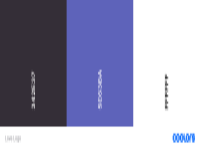

# **Love Logo**

[View the live project here](https://lisaloudness.github.io/ci_project_2/index.html)

## **Table Of Content**

- [**Love Logo**](#love-logo)
  - [**Table Of Content**](#table-of-content)
  - [**Introduction**](#introduction)
  - [**Development**](#development)
  - [Wireframes](#wireframes)
      - [Start Page](#start-page)
      - [Game page](#game-page)
  - [**UX**](#ux)
    - [User Demographic](#user-demographic)
    - [User-Stories](#user-stories)
      - [Current User Goals](#current-user-goals)
      - [New User Goals](#new-user-goals)
      - [Future User Goals](#future-user-goals)
  - [**UI**](#ui)
    - [**Layout**](#layout)
    - [Structure](#structure)
  - [**Color scheme**](#color-scheme)
  - [**Testing**](#testing)
  - [**Technologies Used**](#technologies-used)
    - [**Main Languages Used**](#main-languages-used)
    - [**Frameworks, Libraries \& Programs Used**](#frameworks-libraries--programs-used)
  - [Media](#media)
  - [**Deployment**](#deployment)
  - [GitHub Pages](#github-pages)
  - [To run locally](#to-run-locally)
  - [**Bugs**](#bugs)
  - [**Future Development**](#future-development)
  - [**Credits**](#credits)
  - [**Acknowledgements**](#acknowledgements)

## **Introduction**

Welcome to the Love Logo Quiz!

Love Logo is a mindful quiz that helps focus and concentration but most of all it's fun.
The inspiration for this quiz are my children. I wanted to develop a game that develops cognitive intelligence and visual memory.
It can be played on your own or with others.  With this game, screen time becomes a positive neurological exercise, developing critical thinking, spelling and attention to detail.
Lovo Logo is intended for children and adults (5+years).

Please note that this quiz was created for the Code Institute’s Milestone Project 2 as part of their Diploma in Full Stack Software Development. The requirements are to make an interactive front-end website using HTML, CSS, and Javascript.  

[Back to top](#love-logo)

## **Development**

To represent user stories for multiple end users informal discussions were held with:

- 48 year old man
- 5 year old girl
- 12 year old boy

## Wireframes

#### Start Page

#### Game page

[Back to top](#love-logo)

## **UX**

### User Demographic

Current users will be parents wanting to play an interactive quiz.

Current users will be children wanting to play an interactive quiz.

New users will be acquaintances of the current user audience.

New users will want to play an interactive quiz.

Future users will be people who want to play an interactive quiz.

### User-Stories

#### Current User Goals

1. As a current user, I want to make sure the content is applicable to children
2. As a current user, I want to easily understand the purpose of the game
3. As a current user, I want to have fun while learning

#### New User Goals

1. As a new user, I want to have fun.
2. As a new user, I want the quiz to provide thought-provoking challenges in a short space of time.
3. As a new user, I want attractive and relevant visuals that work with the content so the content is intuitive.

#### Future User Goals

1. As a future user, I want to see attractive and relevant visuals
2. As a future user, I want to be informed and educated so I get the information I'm browsing for.
3. As a future user, I want to play a game with my child.

[Back to top](#love-logo)

## **UI**

### **Layout**

- A simple and colorful page structure so that the user can easily find the game
- "Play" button - takes the user to the play section
- "How to play?" button - provides information about the game rules
- Incorrect guesses counter - the player shall have 4 incorrect guesses per logo
- 2 minute timer shown as a reverse progress bar. The player will need to guess as many correct logos as they can within two minutes.
- "Incorrect Modal" - triggered when the player either guesses 4 incorrect letters
- "Well Done Modal" - triggered when the player guesses the correct letters to reveal the name of the brand
- Contact form - user can contact the game provider if he has questions or suggestions for the game
- Footer - contains mail address and social links

### Structure

- **Title**  
  - located at the top of the page and will also navigate to home page on click.

- **Container**
  - White container holds quiz content positioned page center

- **Play Section**  
  - within the container, the Play Screen consists of 2 sections. The Logo image question is displayed on the left and the quiz elements are displayed on the right. The dynamic keyboard is live for the user to select the letters that they believe is the name of the brand.

- The design of this site is bright and bold with 2 tone colors. The aesthetic design of the game is kept simple to enable an intuitive UX experience and the main goal of this game is to be fun. The site is intended for children and adults and the content of the logos can be easily adapted and updated to target specific user groups.

The quiz consists of 2 main pages:-
The first page is the landing page of the game and consists of a title and content container. The container contains the game brand logo and  3 control buttons:-

- **Play Button**  
  - located in the container above the "How to Play" button, takes the user to the game section.
- **How to play Button**  
  - located in the container below the "Play" button, with a click a modal opens that displays text stating how to play the game.

- **High Score Button**  
  - located in the container below the "How To Play" button. Local Storage to display high scores list.

The second page is the game section. This section contains the game container. On loading, the dynamic keyboard populates inside the container, using the same bold color as the previous control buttons.  Above the keyboard is the word guess area which, visually, are underscores, until the user selects a correct letter which then is made visible in the word.
The dynamic keyboard is populated using JS and has the same layout as a traditional keyboard.  After a letter has been selected, the keyboard key will change color, indicating to the user that the letter has been used during the game and is now inactive.
Incorrect Guesses counter and Overall Score counter is positioned in container right.

The picture of the logo is positioned left side of the game container.

## **Color scheme**

Using the [COOLERS](https://coolors.co/image-picker) color palette generator, the color scheme chosen is based on the logo.

[Back to top](#love-logo)

## **Testing**

All testing performed for Milestone Project 2 can be found here:
[View Test Document here](/TESTING.md)

## **Technologies Used**

### **Main Languages Used**

- [JavaScript](https://en.wikipedia.org/wiki/JavaScript "Link to JavaScipt Wiki")

- [HTML5](https://en.wikipedia.org/wiki/HTML5 "Link to HTML5 Wiki")

- [CSS3](https://en.wikipedia.org/wiki/Code_Composer_Studio "Link to CSS Wiki")

### **Frameworks, Libraries & Programs Used**

- [Google Fonts](https://fonts.google.com/ "Link to Google Fonts")
  - Google fonts was used to import the fonts "Nunito"and "Roboto"into the style.css file. These fonts were used throughout the project.
- [Font Awesome](https://fontawesome.com/ "Link to FontAwesome")
  - Font Awesome was used to import icons (e.g. social media icons) for UX purposes.
- [Code Anywhere](https://www.codeanywhere.com/ "Link to Code Anywhere homepage")
  - Code Anywhere was used for writing code, committing, and then pushing to GitHub.
- [GitHub](https://github.com/ "Link to GitHub")
  - GitHub was used to store the project after pushing
- [Balsamiq](https://balsamiq.com/ "Link to Balsamiq homepage")
  - Balsamiq was used to create the wireframes during the design process.
- [Microsoft Paint](https://en.wikipedia.org/wiki/Microsoft_Paint "Link to Wikipedia Microsoft Paint")
  - Microsoft Paint was used for resizing images and editing photos for the website.
- [Am I Responsive?](http://ami.responsivedesign.is/# "Link to Am I Responsive Homepage")
  - Am I Responsive was used in order to see responsive design throughout the process and to generate mockup imagery to be used.
- [FREE FORMATTER](https://www.freeformatter.com/ "Link to Free Formatter home page")
  - Free Formatter was used to format all html script.

## Media

[Wordsup](https://wordsup.co.uk/logo-quiz.php#google_vignette) - was used for all brand images during gameplay.
[IconScout](https://iconscout.com/) - was used for all the emojis in the quiz.

[Back to top](#love-logo)  

## **Deployment**

## GitHub Pages

1. Log into GitHub and locate the repository 'ci_project_2'
2. [Click here to view](https://github.com/lisaloudness/ci_project_2/settings/pages)
3. At the top locate the settings option.
4. Scroll towards the bottom of the page and locate GitHub Pages.
5. Under 'Source' dropdown, click 'Master' from the options.
6. Click the save button.
6. The site is now published, it may not be available immediately.
7. The site URL is visible on the top of "Github Pages".

## To run locally

1. Log into GitHub and select a repository to download.
2. Select code and Download the ZIP file.
3. Once the download is complete, you can extract the file and use it in your local environment.

## **Bugs**

1. High score is logged twice onto the list - at the end of the game and when the High score button is clicked.

## **Future Development**

1. Add more levels to increase difficulty
2. Tailor the content to specific age groups (5-10; 8-15; 10+)
3. Tailor the logos into specific categories (ie. cars, confectionary, toys, etc)
4. Add music during gameplay.
5. Add sound effects to emphasize emoji.

## **Credits**

- [CodingNepal](https://www.youtube.com/watch?v=hSSdc8vKP1I&t=398s) - youtube
- [Coding Pen](https://codepen.io/Rudchyk/pen/qNOEGj - for progress bar

## **Acknowledgements**

1. Big thanks to my children for testing the website.
2. Iris Smok - Cohort Facilitator for her continued support.
3. Seun - Mentor for her valued input and suggestions.

[Back to top](#love-logo)
