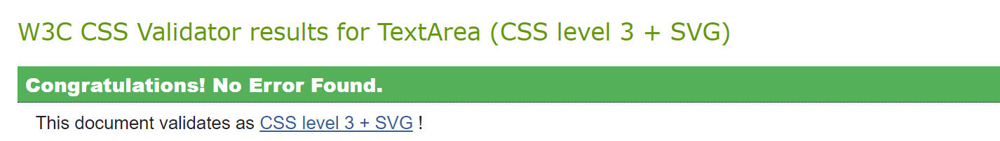

# **Love Logo - Testing**

**[Main README.md file](/README.md)**

**[View live project](https://lisaloudness.github.io/ci_project_2/)**

**[View Github repository](https://github.com/lisaloudness/ci_project_2)**

 

## **Table of Contents**

- [**Love Logo - Testing**](#love-logo---testing)
  - [**Table of Contents**](#table-of-contents)
  - [**Testing User Stories**](#testing-user-stories)
  - [**Manual Testing**](#manual-testing)
  - [**Automated Testing**](#automated-testing)
    - [Code Validation](#code-validation)
    - [Browser Validation](#browser-validation)
  - [**User Testing**](#user-testing)

 

## **Testing User Stories**

- As a current user, I want to make sure the content is applicable to children.
  - The branded logos used are household brands.
  - The site is easy to navigate with short word buttons.
  - The keyboard buttons are disabled after click.

- As a current user, I want to easily understand the purpose of the game.
  - How to Play button initiates a list of instructions in a modal.
  - The UX is easy to understand.
  
- As a current user, I want to have fun while learning.
  - The user is engaged and challenged whilst trying to recall or guess the logo.
  - Can be played on your own or with others.
  
- As a new user, I want to have fun.
  - The user is engaged and challenged whilst trying to recall or guess the logo.
  - Short-term concentration sprints.
  
- As a new user, I want the quiz to provide thought-provoking challenges in a short space of time.
  - The user is engaged and challenged whilst trying to recall or guess the logo.
  - The 2 minute timer is an added challenge to guess as many logos within the timeframe.
  
- As a new user, I want attractive and relevant visuals that work with the content so the content is intuitive.
  - The title, which is in a prominent position throughout the game, always navigates to the home page and control buttons container.
  - Bright bold contrasting colors are used throughout.

- As a future user, I want to see attractive and relevant visuals.
  - The buttons are clearly labelled and descriptive of the content.
- As a future user, I want to be informed and educated so I get the information I'm browsing for.
  - The logo which is in a prominent position at the top of all pages, always navigates to the home page.
  
- As a future user, I want to play a game with my child.
  - As a developer, I have played with my child and confirm we both had lots of fun working together to complete the quiz.

[Back to top](#love-logo---testing)

 

## **Manual Testing**

1. Developer Tools were used throughout the development process to test website responsiveness on all devices.

2. All links within the site were tested to ensure that:
   - All buttons executed correct functions.
   - All navigation links are working.
   - Hover states work correctly.

3. Javascript was tested to ensure that:
   - The quiz performed as expected.

4. Website compatibility was tested on Firefox, Chrome, Edge and Safari browsers. No issues to note.

[Back to top](#love-logo---testing)
 

## **Automated Testing**

### Code Validation

JSHint was used to detect errors and potential problems in JavaScript code.
[JSHint version 2.13.6](https://jshint.com/) - There were no errors detected.

The W3C Markup Validator and W3C CSS Validator Services were used to validate the website to ensure there were no syntax errors in the html and css code.  
[W3C Markup Validator](https://validator.w3.org) - There were no error detected.

[W3C CSS Validator](https://jigsaw.w3.org/css-validator/) - There were no error detected.

### Browser Validation

The Chrome Light House testing was used to audit the performance, accessibility, best practices, and SEO. Here are the results:

1. Desktop
   - Desktop [Full report can be found here](LHdesktop.json)
   - 

2. Mobile
   - Mobile [Full report can be found here](assets/testing/LHmobile.json)
   - 

[Back to top](#love-logo---testing)
 

## **User Testing**

The website was shared with family and colleagues for their valued feedback. Common issues noted in the feedback were:

- It would be nice to have the option to use corresponding keyboard keys.
- A quit / home option is needed on mobile viewport. I agree with this and simply ran out of time to complete. The title always navigates to homescreen on other viewports.  
  
